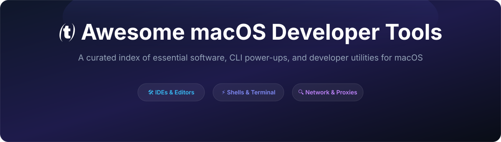

# Awesome macOS Developer Tools 🍏 🛠️

A curated directory of exceptional macOS applications, CLI utilities, window power-ups, reverse-engineering tools, and design suites tailored for Apple Platforms (iOS, macOS, visionOS) & software engineers.

  

---

## 📑 Contents

- [IDEs & Code Editors](#-ides--code-editors)
- [Terminal & Modern Shells](#-terminal--modern-shells)
- [Git & Version Control](#-git--version-control)
- [Apple Ecosystem & SwiftUI Tools](#-apple-ecosystem--swiftui-tools)
- [API, Network & Proxy Debugging](#-api-network--proxy-debugging)
- [Reverse Engineering & Inspection](#-reverse-engineering--inspection)
- [Window & Menu Bar Superpowers](#-window--menu-bar-superpowers)
- [Database & Storage Explorers](#-database--storage-explorers)
- [Contributing](#-contributing)

---

## 🛠️ IDEs & Code Editors

| Tool | Description | License | Install via Brew |
| :--- | :--- | :--- | :--- |
| **[Xcode](https://developer.apple.com/xcode/)** | Apple's official IDE for iOS, macOS, watchOS, and visionOS development. | Proprietary | `xcode-select --install` |
| **[Cursor](https://www.cursor.com/)** | AI-first code editor built on VS Code with intelligent code generation. | Freemium | `brew install --cask cursor` |
| **[Visual Studio Code](https://code.visualstudio.com/)** | Extensible code editor with massive Swift, Python, and web ecosystems. | Open Source | `brew install --cask visual-studio-code` |
| **[Zed](https://zed.dev/)** | High-performance, GPU-accelerated code editor written in Rust. | Open Source | `brew install --cask zed` |
| **[Sublime Text](https://www.sublimetext.com/)** | Lightweight, blazingly fast text editor for quick edits and huge files. | Shareware | `brew install --cask sublime-text` |

---

## 💻 Terminal & Modern Shells

| Tool | Description | License | Install via Brew |
| :--- | :--- | :--- | :--- |
| **[Ghostty](https://ghostty.org/)** | Fast, feature-rich, GPU-accelerated terminal emulator designed for macOS. | Free | `brew install --cask ghostty` |
| **[Warp](https://www.warp.dev/)** | Rust-based modern terminal with built-in AI, block-based output, and workflows. | Freemium | `brew install --cask warp` |
| **[iTerm2](https://iterm2.com/)** | Mature terminal replacement with split panes, search, and deep customization. | GPL-2.0 | `brew install --cask iterm2` |
| **[Starship](https://starship.rs/)** | Ultra-fast, infinitely customizable cross-shell prompt written in Rust. | ISC | `brew install starship` |
| **[eza](https://github.com/eza-community/eza)** | Modern, color-rich replacement for `ls` with Git status and tree view. | European Union Public License | `brew install eza` |

---

## 🐙 Git & Version Control

| Tool | Description | License | Install via Brew |
| :--- | :--- | :--- | :--- |
| **[Fork](https://git-fork.com/)** | Fast, visual Git client with interactive rebase, merge conflict resolver, and git-flow. | Paid | `brew install --cask fork` |
| **[Tower](https://www.git-tower.com/mac)** | Powerful Git GUI with drag-and-drop interactive rebase and undo features. | Paid | `brew install --cask tower` |
| **[Lazygit](https://github.com/jesseduffield/lazygit)** | Simple terminal UI for git commands with intuitive keyboard navigation. | MIT | `brew install lazygit` |
| **[Sublime Merge](https://www.sublimemerge.com/)** | Blazing-fast Git client from Sublime Text with 3-way merge editing. | Shareware | `brew install --cask sublime-merge` |

---

## 🍏 Apple Ecosystem & SwiftUI Tools

| Tool | Description | License | Install via Brew |
| :--- | :--- | :--- | :--- |
| **[SF Symbols](https://developer.apple.com/sf-symbols/)** | Apple's official icon library containing over 6,000 consistent system glyphs. | Free | `brew install --cask sf-symbols` |
| **[xcodes](https://github.com/RobotsAndPencils/xcodes)** | The easiest command-line tool to install and switch between multiple Xcode versions. | MIT | `brew install xcodesorg/made/xcodes` |
| **[Simulator Plus](https://github.com/yusuf-yildirim/SimulatorPlus)** | Enhances iOS Simulator with bezel frames, media drops, and quick status controls. | MIT | Open Source |
| **[SwiftUI NotchKit](https://github.com/nilkanthdesai76/swiftui-notch-kit)** | Swift package to compute MacBook notch dimensions and display safe insets. | MIT | SPM |

---

## 🌐 API, Network & Proxy Debugging

| Tool | Description | License | Install via Brew |
| :--- | :--- | :--- | :--- |
| **[Proxyman](https://proxyman.io/)** | Native macOS HTTP/HTTPS debugging proxy with iOS Simulator auto-intercept. | Freemium | `brew install --cask proxyman` |
| **[Bruno](https://www.usebruno.com/)** | Fast, Git-friendly open-source API client stored in plain text files. | MIT | `brew install --cask bruno` |
| **[Charles Proxy](https://www.charlesproxy.com/)** | Reliable HTTP proxy, SSL proxying, and bandwidth throttling tool. | Shareware | `brew install --cask charles` |
| **[Postman](https://www.postman.com/)** | Collaborative platform for API development, mocking, and automated testing. | Freemium | `brew install --cask postman` |

---

## 🔍 Reverse Engineering & Inspection

| Tool | Description | License | Install via Brew |
| :--- | :--- | :--- | :--- |
| **[Reveal](https://revealapp.com/)** | 2D/3D visual runtime inspector for iOS and macOS UIKit and AppKit hierarchies. | Commercial | `brew install --cask reveal` |
| **[Hopper Disassembler](https://www.hopperapp.com/)** | Binary disassembler and decompiler for macOS, Mach-O executables, and iOS binaries. | Commercial | `brew install --cask hopper-disassembler` |
| **[class-dump](http://stevenygard.com/projects/class-dump/)** | Command-line tool for examining Objective-C runtime information stored in Mach-O files. | GPL-2.0 | `brew install class-dump` |

---

## 🧭 Window & Menu Bar Superpowers

| Tool | Description | License | Install via Brew |
| :--- | :--- | :--- | :--- |
| **[Raycast](https://www.raycast.com/)** | Extendable launcher replacing Spotlight with scripts, clipboard history, and window snapping. | Freemium | `brew install --cask raycast` |
| **[Rectangle](https://rectangleapp.com/)** | Open-source window manager with keyboard shortcuts and snap-to-edge gestures. | MIT | `brew install --cask rectangle` |
| **[Ice](https://github.com/jordanbaird/Ice)** | Powerful menu bar manager to hide and organize status items with custom styling. | MIT | `brew install --cask jordanbaird-ice` |
| **[AeroSpace](https://github.com/nikitabobko/AeroSpace)** | i3-like tiling window manager for macOS with virtual workspaces. | MIT | `brew install --cask aerospace` |

---

## 🗄️ Database & Storage Explorers

| Tool | Description | License | Install via Brew |
| :--- | :--- | :--- | :--- |
| **[TablePlus](https://tableplus.com/)** | Native, ultra-fast GUI for PostgreSQL, MySQL, SQLite, Redis, and DuckDB. | Freemium | `brew install --cask tableplus` |
| **[DB Browser for SQLite](https://sqlitebrowser.org/)** | Open-source visual tool to design, edit, and search CoreData and SQLite databases. | GPL-3.0 | `brew install --cask db-browser-for-sqlite` |

---

## 🤝 Contributing

Have a favorite macOS developer tool that isn't listed? 
1. Check the [Contribution Guidelines](CONTRIBUTING.md).
2. Open a Pull Request adding the tool to the appropriate category.

## 📄 License

Dedicated to the public domain under [Creative Commons Zero (CC0 1.0)](LICENSE).
